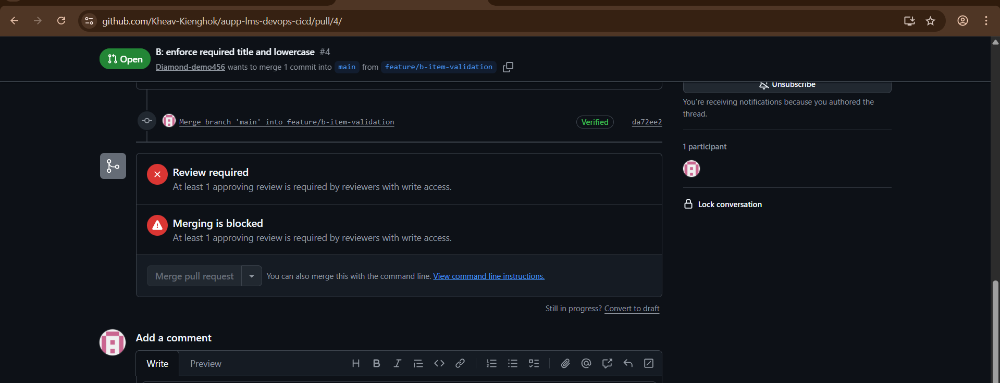
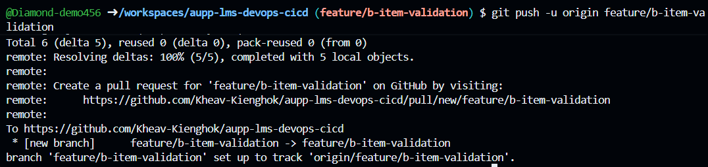
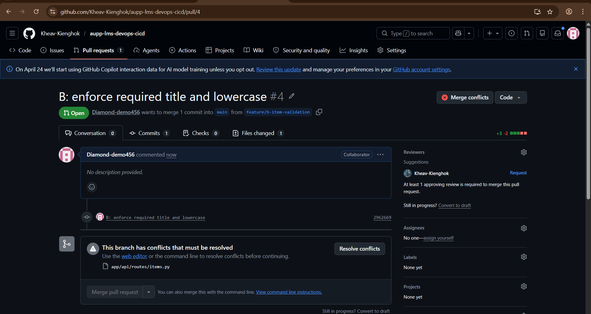
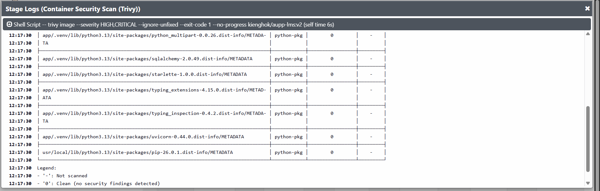
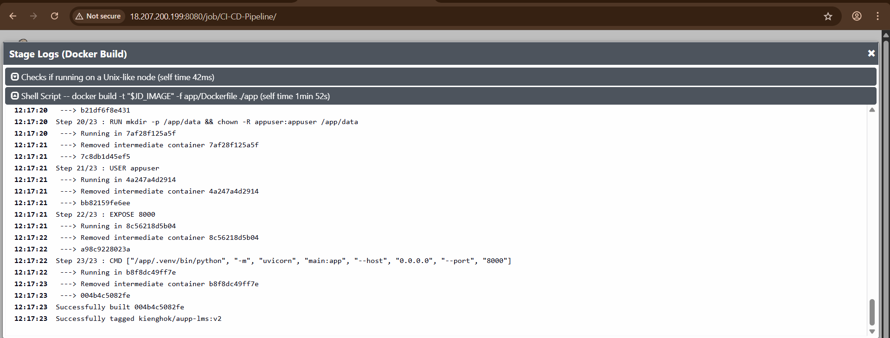
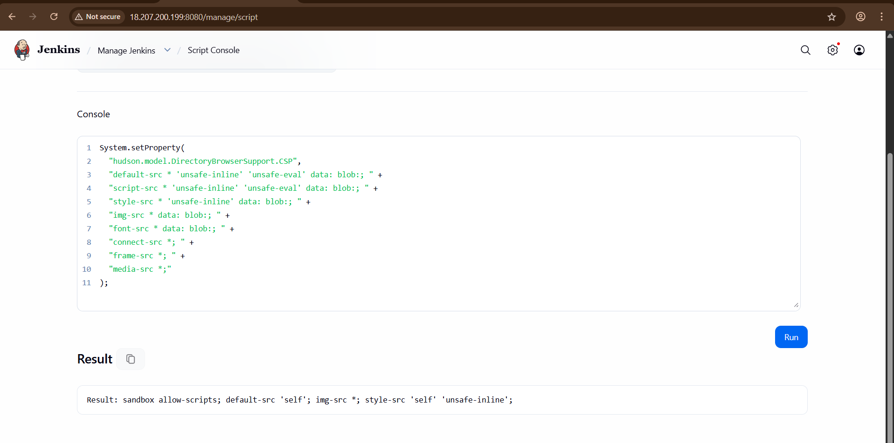

# AUPP LMS DevOps CI/CD Pipeline (Jenkins + SonarQube + Trivy + Docker + Terraform + Prometheus + Grafana)

## Project Overview

This project implements a complete **CI/CD pipeline** for AUPP's internal Learning Management System (LMS) platform (similar to Canvas LMS).  
The goal is to ensure **fast feature delivery**, **secure deployments**, **automated infrastructure provisioning**, and **real-time monitoring**.

The CI/CD pipeline is implemented using **Jenkins**, with integrations including:

- SonarQube (Code Quality)
- Trivy (Security Scanning)
- Docker (Containerization)
- Terraform (Infrastructure as Code)
- AWS EC2 (Deployment Target)
- Prometheus + Grafana (Monitoring & Dashboard)

---

## Assignment Evidence Checklist

### 1. Source Control & Collaboration (GitHub)

#### GitHub Merge Conflict & Resolution Workflow

Below is a step-by-step guide for handling merge conflicts when the main branch is locked. Each step includes a diagram for visual reference and a descriptive explanation.

---

**1. Main branch is locked (no direct push allowed)**


> The main branch is protected. Developers cannot push directly; all changes must go through Pull Requests (PRs).

---

**2. Developer A pushes code (creates a PR)**


> Developer A creates a PR to propose changes. The PR is now awaiting review and approval.

---

**3. PR requires 1 approval**



> The repository is configured to require at least one approval before merging any PR into the main branch.

---

**4. Developer B changes the same code (creates another PR)**



> Developer B also creates a PR, but modifies the same lines of code as Developer A, leading to a potential conflict.

---

**5. Merge conflict occurs**



> When Developer B tries to merge, GitHub detects a merge conflict because both PRs modify the same lines.

---

**6. Resolving the conflict**


> Developer B (or another contributor) must resolve the conflict by editing the files to combine both changes appropriately.

---

**7. After resolving, update the PR**


> After resolving the conflict, the PR is updated. It may require another review/approval.

---

**8. Merge to the main branch**


> Once the conflict is resolved and the PR is approved, it can be merged into the main branch.

---

### 2. Continuous Integration (CI)

#### Continuous Integration (CI) Workflow

Below is a step-by-step guide for the CI process, with each step illustrated and explained:

---

**1. Code pushed to repository (triggers CI pipeline)**


> When code is pushed or a PR is merged, a webhook triggers the Jenkins CI pipeline automatically.

---

Jenkins Plugin
Jenkins Credentials

**2. Jenkins pipeline starts**


> Jenkins picks up the event and starts executing the pipeline defined in the Jenkinsfile.

---

**3. SonarQube code quality scan**


> The pipeline runs a SonarQube scan to analyze code quality, bugs, and code smells. A report is generated.

---

**5. Quality Gate enforcement**


> The build passes only if the SonarQube Quality Gate is successful. If not, the pipeline fails and stops here.

---

**6. Trivy security scan (filesystem & Docker image)**




> Trivy scans the project files and built Docker images for vulnerabilities. Reports are generated for both filesystem and image scans.

---

**7. Build Docker image**



> If all previous steps succeed, Jenkins builds a Docker image for the application.

---

#### Jenkins Plugin: Credentials Management

**9. Jenkins Credentials Plugin setup**


> Jenkins uses the Credentials Plugin to securely store secrets (like Docker registry passwords, SonarQube tokens, etc.). Credentials are referenced in the pipeline for authentication and secure operations.

---

#### Jenkins CLI Command for HTML Report Visibility

**10. Publish HTML Reports via Jenkins CLI**



> To make HTML reports (e.g., SonarQube, Trivy) visible in Jenkins, use the 'HTML Publisher' plugin and configure the pipeline to archive and publish HTML reports.

---

### 3. Infrastructure as Code (Terraform)

    Dockerfile
    Docker build 
    server created using terraform and ansible to configure

### 4. Continuous Deployment (CD)

    After CI success deploy the docker image to the server
    test the server with curl to confirm it work fine

### 5. Monitoring & Observability

    grafana monitoring

---

## Objectives

- Apply GitHub collaboration workflow (branches, PR, review, conflict resolution)
- Automate CI pipeline using Jenkins
- Enforce code quality gates using SonarQube
- Perform vulnerability scanning using Trivy
- Build Docker images for backend APIs
- Provision AWS EC2 automatically using Terraform
- Deploy Docker container automatically to EC2
- Access application from laptop
- Monitor server/container metrics using Prometheus + Grafana

---

## CI/CD Workflow Architecture

### Full DevOps Flow

```bash
    Developer → GitHub → Pull Request → Reviewer Approval 
    → Merge Conflict Resolve → Merge to main  
    → Jenkins Pipeline Runs → SonarQube Scan → Trivy Scan 
    → Docker Build → Terraform Create EC2 → Deploy Docker Image 
    → Access Application → Prometheus Monitoring → Grafana Dashboard
```

---

## Tools & Technologies Used

|       Category         |    Tool    |
|------------------------|------------|
| Source Control         | GitHub     |
| CI/CD Pipeline         | Jenkins    |
| Code Quality           | SonarQube  |
| Security Scan          | Trivy      |
| Containerization       | Docker     |
| Infrastructure as Code | Terraform  |
| Cloud Provider         | AWS EC2    |
| Monitoring             | Prometheus |
| Visualization          | Grafana    |
